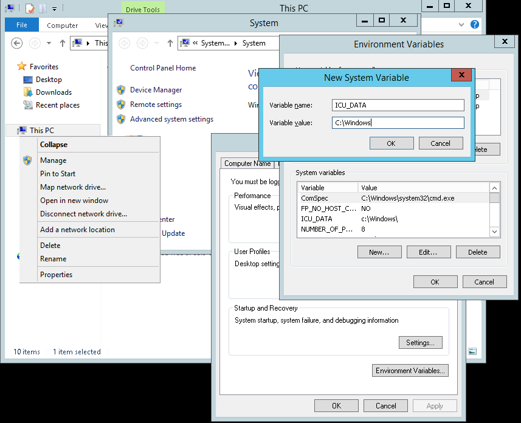

# Compiling ArangoDB under Windows

## Problem

I want to compile ArangoDB 3.0 (currently still in development - thus its only available in the _devel_ git branch) and onwards under Windows.

**Note:** For this recipe you need at least ArangoDB 3.0;
For ArangoDB version before 3.0 look at the [old Compiling ArangoDB under Windows](CompilingUnderWindows.md).

## Solution

With ArangoDB 3.0 a complete cmake environment was introduced. This also streamlines the dependencies on windows.
We sugest to use [chocolatey.org](https://chocolatey.org/) to install most of the dependencies. For sure
most projects offer their own setup & install packages, chocolatey offers a simplified way to install them
with less userinteractions. You can even use chocolatey via the brand new
[ansibles 2.0 winrm facility](http://docs.ansible.com/ansible/intro_windows.html)
to do unattended installions of some software on windows - the cool thing linux guys always told you about.

### Ingredients

First install the choco package manager via this tiny cmdlet:

    @powershell -NoProfile -ExecutionPolicy Bypass -Command "iex ((new-object net.webclient).DownloadString('https://chocolatey.org/install.ps1'))" && SET PATH=%PATH%;%ALLUSERSPROFILE%\chocolatey\bin

Since choco currently fails to alter the environment for
[Microsoft Visual Studio](https://www.visualstudio.com/en-us/products/visual-studio-community-vs.aspx),
we suggest to download and install Visual Studio by hand.
Currently Visual Studio 2015 is the only supported option.

Now you can invoke the choco package manager for an unattended install of the dependencies (needs to be run with Administrator privileges):

    choco install -y cmake nsis python2 procdump windbg wget nuget.commandline

Then we fetch the [OpenSSL](https://openssl.org) library via the nuget commandline client:

    nuget install openssl

If you intend to run the unittests or compile from git, you also need (needs to be run with Administrator privileges again):

    choco install -y git winflexbison procdump ruby ruby.devkit

And manually install the requirements via the `Gemfile` fetched from the ArangoDB Git repository (needs to be run with Administrator privileges):

    wget https://raw.githubusercontent.com/arangodb/arangodb/devel/UnitTests/HttpInterface/Gemfile
    set PATH=%PATH%;C:\tools\DevKit\bin;C:\tools\DevKit\mingw\bin
    gem install bundler
    bundler

Note that the V8 build scripts and gyp aren't compatible with Python 3.x hence you need python2!

### Building ArangoDB
Download and extract the release tarball from https://www.arangodb.com/download/

Or clone the github repository, and checkout the branch or tag you need (devel, 3.0)

    git clone https://github.com/arangodb/arangodb.git
    cd arangodb
    git checkout devel

Generate the Visual studio project files, and check back that cmake discovered all components on your system:

    mkdir Build64
    cd Build64
    cmake -DOPENSSL_ROOT_DIR=%UserProfile%/openssl.v140.windesktop.msvcstl.dyn.rt-dyn.x64.1.0.2.0 -G "Visual Studio 14 Win64" ..

You can now load these in the Visual Studio IDE or use cmake to start the build:

    cmake --build . --config RelWithDebInfo

In order to execute the binaries you need to copy the ICU datafile into the directory containing the
executable

    cp ../3rdParty/V8/V8-4.9.391/third_party/icu/source/data/in/icudtl.dat Build64/bin/Debug/icudt54l.dat

If you intend to use the machine for development purposes, it may be more practical to copy it somewhere else:

    cp ../3rdParty/V8/V8-4.9.391/third_party/icu/source/data/in/icudtl.dat /cygdrive/c/Windows/icudt54l.dat

And configure your environment (yes this instruction remembers to the hitchhikers guide to the galaxy...) so that
`ICU_DATA` points to `c:\\Windows`. You do that by opening the explorer,
right click on `This PC` in the tree on the left, choose `Properties` in the opening window `Advanced system settings`,
in the Popup `Environment Variables`, another popup opens, in the `System Variables` part you click `New`, 
And Key: :`ICU_DATA` to value: `c:\\Windows`

You can then run the unittests like that:

    build64/bin/RelWithDebInfo/arangosh.exe \
      ./scripts/unittest \
      all \
      --ruby c:/tools/ruby22/bin/ruby \
      --rspec c:/tools/ruby22/bin/rspec \
      --buildType ${CONFIGURATION} \
      --skipNondeterministic true \
      --skipTimeCritical true
      --skipBoost true \
      --skipGeo true
  
# Documentation
The documentation still requires a [cygwin](https://www.cygwin.com/) environment. Here the hints to get it properly installed:

You need at least `make` from cygwin. Cygwin also offers a `cmake`. Do **not** install this version.

You should also issue these commands to generate user informations for the cygwin commands:

    mkpasswd > /etc/passwd
    mkgroup > /etc/group

Turning ACL off (noacl) for all mounts in cygwin fixes permissions troubles that may appear in the build:

    # /etc/fstab
    #
    #    This file is read once by the first process in a Cygwin process tree.
    #    To pick up changes, restart all Cygwin processes.  For a description
    #    see https://cygwin.com/cygwin-ug-net/using.html#mount-table
    
    # noacl = Ignore Access Control List and let Windows handle permissions
    C:/cygwin64/bin  /usr/bin   ntfs      binary,auto,noacl           0  0
    C:/cygwin64/lib  /usr/lib   ntfs      binary,auto,noacl           0  0
    C:/cygwin64      /          ntfs      override,binary,auto,noacl  0  0
    none             /cygdrive  cygdrive  binary,posix=0,user,noacl   0  0

### Enable native symlinks for Cygwin and git

Cygwin will create proprietary files as placeholders by default instead of
actually symlinking files. The placeholders later tell Cygwin where to resolve
paths to. It does not intercept every access to the placeholders however, so
that 3rd party scripts break. Windows Vista and above support real symlinks,
and Cygwin can be configured to make use of it:

    # use actual symlinks to prevent documentation build errors
    # (requires elevated rights!)
    export CYGWIN="winsymlinks:native"

Note that you must run Cygwin as administrator or change the Windows group
policies to allow user accounts to create symlinks (`gpedit.msc` if available).

BTW: You can create symlinks manually on Windows like:

    mklink /H target/file.ext source/file.ext
    mklink /D target/path source/path
    mklink /J target/path source/path/for/junction

And in Cygwin:

    ln -s source target

NodeJS:

    choco install -y nodejs

Gitbook:

    npm install -g gitbook-cli

**Authors**:
[Frank Celler](https://github.com/fceller),
[Wilfried Goesgens](https://github.com/dothebart) and
[Simnran Bruchseifer](https://github.com/Simran-B).

**Tags**: #windows
