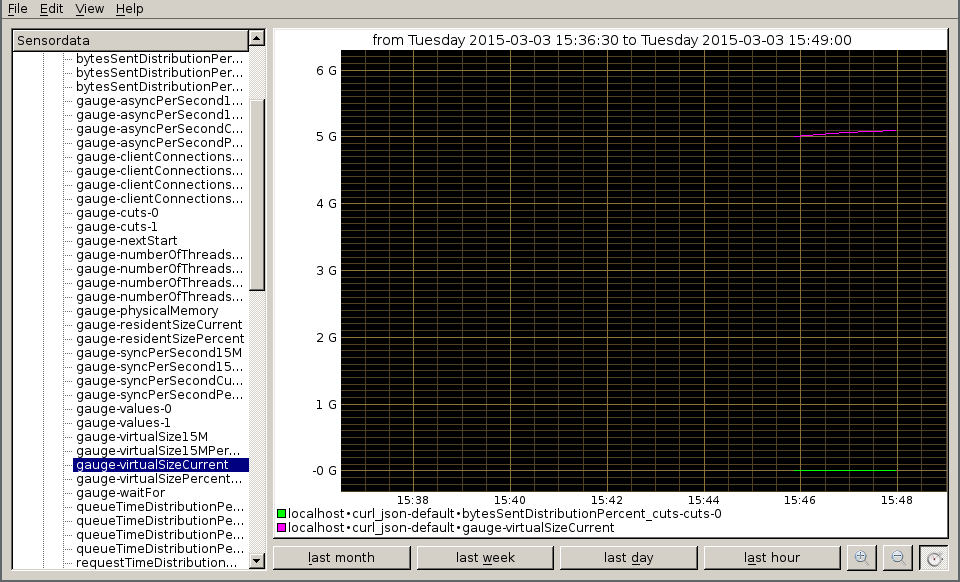

* Monitoring ArangoDB using collectd

##Problem

The Aardvark webinterface shows a nice summary of the current state; I want to see similar numbers in my monitoring system so I can analyze the system usage post mortem or send alarms on failure.

## Solution

[Collectd](http://collectd.org) is an excellent tool to gather all kinds of metrics from a system and deliver it to a central monitoring like [Graphite](http://graphite.wikidot.com/screen-shots) and / or [Nagios](http://www.nagios.org/).

### Ingredients

For this recipe you need to install the following tools:

  * [collectd >= 5.4.2](https://collectd.org/) The aggregation Daemon
  * [kcollectd](https://www.forwiss.uni-passau.de/~berberic/Linux/kcollectd.html) for inspecting the data

### Configuring collectd

For aggregating the values, we will use the [cURL-JSON plugin](https://collectd.org/wiki/index.php/Plugin:cURL-JSON). We will store the values using the [RoundRobinDatabase writer](https://collectd.org/wiki/index.php/RRD) which kcollectd can later on present to you.

We assume your collectd is comes from your Distribution, and reads its config from /etc/collectd/collectd.conf; Since this file tends to become pretty unreadable quick, we use the include mechanism:

    <Include "/etc/collectd/collectd.conf.d">
      Filter "*.conf"
    </Include>

This way we can make each metric group one compact set config files; It consists of 3 components:
* Loading the plugin
* adding metrics to the TypesDB
* The configuration for the plugin itself

#### rrdtool
We will use the [Round Robin Database](http://oss.oetiker.ch/rrdtool/) as storage backend for now. It creates its own tiny database files which can take values for a specific time range and are fixed in file size. Later on you may choose more advanced writer-plugins, which may do network distribution of your metrics or integrate the above mentioned Graphite, or your already established monitoring, etc.

For the RRD We will go pretty much with defaults here:

    # Load the plugin:
    LoadPlugin rrdtool
    <Plugin rrdtool>
       DataDir "/var/lib/collectd/rrd"
    #  CacheTimeout 120
    #  CacheFlush 900
    #  WritesPerSecond 30
    #  CreateFilesAsync false
    #  RandomTimeout 0
    #  
    # The following settings are rather advanced
    # and should usually not be touched:
    #   StepSize 10
    #   HeartBeat 20
    #   RRARows 1200
    #   RRATimespan 158112000
    #   XFF 0.1
    </Plugin>

#### cURL JSON
Collectd comes with a wide range of Metric aggregation plugins; Many tools today use [JSON](http://json.org) as data formating grammer; so does ArangoDB. Therefore a plugin offering to fetch json documents via HTTP is the perfect match as integration interface:

    # Load the plugin:
    LoadPlugin curl_json
    # we need to use our own types to generate individual names for our gauges:
    TypesDB "/etc/collectd/collectd.conf.d/arangodb_types.db"
    <Plugin curl_json>
      # Adjust the URL so collectd can reach your arangod:
      <URL "http://localhost:8529/_db/_system/_admin/aardvark/statistics/short">
       # Set your authentication to Aardvark here:
       # User "foo"
       # Password "bar"
        <Key "totalTimeDistributionPercent/values/0">
           Type "totalTimeDistributionPercent_values"
         </Key>
         <Key "totalTimeDistributionPercent/cuts/0">
           Type "totalTimeDistributionPercent_cuts"
         </Key>
         <Key "requestTimeDistributionPercent/values/0">
           Type "requestTimeDistributionPercent_values"
         </Key>
         <Key "requestTimeDistributionPercent/cuts/0">
           Type "requestTimeDistributionPercent_cuts"
         </Key>
         <Key "queueTimeDistributionPercent/values/0">
           Type "queueTimeDistributionPercent_values"
         </Key>
         <Key "queueTimeDistributionPercent/cuts/0">
           Type "queueTimeDistributionPercent_cuts"
         </Key>
         <Key "bytesSentDistributionPercent/values/0">
           Type "bytesSentDistributionPercent_values"
         </Key>
         <Key "bytesSentDistributionPercent/cuts/0">
           Type "bytesSentDistributionPercent_cuts"
         </Key>
         <Key "bytesReceivedDistributionPercent/values/0">
           Type "bytesReceivedDistributionPercent_values"
         </Key>
         <Key "bytesReceivedDistributionPercent/cuts/0">
           Type "bytesReceivedDistributionPercent_cuts"
         </Key>
         <Key "numberOfThreadsCurrent">
           Type "gauge"
         </Key>
         <Key "numberOfThreadsPercentChange">
           Type "gauge"
         </Key>
         <Key "virtualSizeCurrent">
           Type "gauge"
         </Key>
         <Key "virtualSizePercentChange">
           Type "gauge"
         </Key>
         <Key "residentSizeCurrent">
           Type "gauge"
         </Key>
         <Key "residentSizePercent">
           Type "gauge"
         </Key>
         <Key "asyncPerSecondCurrent">
           Type "gauge"
         </Key>
         <Key "asyncPerSecondPercentChange">
           Type "gauge"
         </Key>
         <Key "syncPerSecondCurrent">
           Type "gauge"
         </Key>
         <Key "syncPerSecondPercentChange">
           Type "gauge"
         </Key>
         <Key "clientConnectionsCurrent">
           Type "gauge"
         </Key>
         <Key "clientConnectionsPercentChange">
           Type "gauge"
         </Key>
         <Key "physicalMemory">
           Type "gauge"
         </Key>
         <Key "nextStart">
           Type "gauge"
         </Key>
         <Key "waitFor">
           Type "gauge"
         </Key>
         <Key "numberOfThreads15M">
           Type "gauge"
         </Key>
         <Key "numberOfThreads15MPercentChange">
           Type "gauge"
         </Key>
         <Key "virtualSize15M">
           Type "gauge"
         </Key>
         <Key "virtualSize15MPercentChange">
           Type "gauge"
         </Key>
         <Key "asyncPerSecond15M">
           Type "gauge"
         </Key>
         <Key "asyncPerSecond15MPercentChange">
           Type "gauge"
         </Key>
         <Key "syncPerSecond15M">
           Type "gauge"
         </Key>
         <Key "syncPerSecond15MPercentChange">
           Type "gauge"
         </Key>
         <Key "clientConnections15M">
           Type "gauge"
         </Key>
         <Key "clientConnections15MPercentChange">
           Type "gauge"
         </Key>
      </URL>
    </Plugin>

To circumvent the shortcomming of the curl_json plugin to only take the last path element as name for the metric, we need to give them a name using our own types.db file in /etc/collectd/collectd.conf.d/arangodb_types.db: 

    totalTimeDistributionPercent_values		value:GAUGE:U:U
    totalTimeDistributionPercent_cuts		value:GAUGE:U:U
    requestTimeDistributionPercent_values		value:GAUGE:U:U
    requestTimeDistributionPercent_cuts		value:GAUGE:U:U
    queueTimeDistributionPercent_values		value:GAUGE:U:U
    queueTimeDistributionPercent_cuts		value:GAUGE:U:U
    bytesSentDistributionPercent_values		value:GAUGE:U:U
    bytesSentDistributionPercent_cuts		value:GAUGE:U:U
    bytesReceivedDistributionPercent_values		value:GAUGE:U:U
    bytesReceivedDistributionPercent_cuts		value:GAUGE:U:U

#### Rolling your own
You may want to also monitor your own metrics from ArangoDB So here is a simple example how to use the config:

    {
     "testArray":[1,2],
     "testArrayInbetween":[{"blarg":3},{"blub":4}],
     "testDirectHit":5,
     "testSubLevelHit":{"oneMoreLevel":6}
    }

This config snippet will parse the JSON above:

    <Key "testArray/0">
      Type "gauge"
      # Expect: 1
    </Key>
    <Key "testArray/1">
      Type "gauge"
      # Expect: 2
    </Key>
    <Key "testArrayInbetween/0/blarg">
      Type "gauge"
      # Expect: 3
    </Key>
    <Key "testArrayInbetween/1/blub">
      Type "gauge"
      # Expect: 4
    </Key>
    <Key "testDirectHit">
      Type "gauge"
      # Expect: 5
    </Key>
    <Key "testSubLevelHit/oneMoreLevel">
      Type "gauge"
      # Expect: 6
    </Key

## get it Served

We now (re)start collectd so it picks up our configuration:

    /etc/init.d/collectd start

We will inspect the syslog to revalidate nothing went wrong:

    Mar  3 13:59:52 localhost collectd[11276]: Starting statistics collection and monitoring daemon: collectd.
    Mar  3 13:59:52 localhost systemd[1]: Started LSB: manage the statistics collection daemon.
    Mar  3 13:59:52 localhost collectd[11283]: Initialization complete, entering read-loop.

Collectd adds the hostname to the directory address; so we now should have files like these:

     -rw-r--r-- 1 root root 154888 Mar  2 16:53 /var/lib/collectd/rrd/localhost/curl_json-default/gauge-numberOfThreads15M.rrd

Now we start kcollectd to view the values in this rrd file:

Since we only just started putting values in, we need to choose 'last hour' and zoom in a little more to inspect the values.

Finished with this dish, wait for more metrics to come in other recepies.