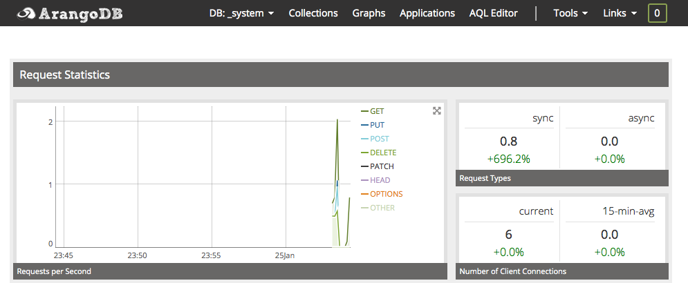
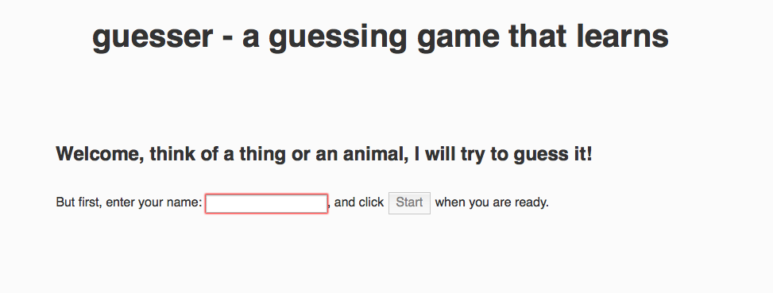

# ArangoDB on Mesosphere using Marathon and Dockers

## Problem 

I want to use ArangoDB in Mesos with Docker containers.

## Solution

Mesos in its newest version makes it very easy to use ArangoDB, because
[Mesosphere](https://mesosphere.com/2014/11/10/docker-on-mesos-with-marathon/)
has added support for docker containers. Together with Marathon to start the
front-end and back-end parts of an application, installation is straight
forward.

My colleague Max has written a guesser game with various front-ends and ArangoDB
as backend. In order to get the feeling of being part of the Mesosphere, I have
started to set up this game in an DigitalOcean environment.

### First Steps

The guesser game consists of a front-end written as express application in node
and a storage back-end using ArangoDB and a small API developed with the Foxx
microservices framework.

The front-end application is available as image

    arangodb/example-guesser

and the ArangoDB back-end with the Foxx API as

    arangodb/example-guesser-db

The dockerfiles used to create the images are available from github

    https://github.com/arangodb/guesser

### Set Up the Environment

Follow the instructions on [Mesosphere](https://mesosphere.com) to setup an
environment with docker support. You should end up with ssh access to the Mesos
master.

### Set Up the Application

For this torutial we bind the database to a fixed port on the mesos
environment. Please not, that the
[mesosphere uses HAproxy](https://mesosphere.github.io/marathon/docs/service-discovery-load-balancing.html)
to map the global port to the real host and port. The servers created by Mesosphere
will have a HAproxy defined on all masters and slaves.

That means, if we chose `32333` as
[service port](http://mesosphere.github.io/marathon/docs/native-docker.html) for the
database, it will be reachable on this port on all masters and slaves. The app
definition for the database looks like

    {
      "id": "/guesser/database",
      "apps": [
         {
           "id": "/guesser/database/arangodb", 
           "container": {
             "docker": {
               "image": "arangodb/example-guesser-db",
               "network": "BRIDGE",
               "portMappings": [
                   { "containerPort": 8529, "hostPort": 0, "servicePort": 32222, "protocol": "tcp" }
               ]
             }
           },
           "cpus": 0.2,
           "mem": 512.0,
           "instances": 1
         }
       ]
    }

This will start the docker image for the back-end and binds the port to 32222.

Inside the docker container an environment variable `HOST` is set be the mesos slave
to point to the slave. The front-end can therefore access port `32222` on this host
to contact the HAproxy, gaining access to the database.

The app definition for the front-end looks like

    {
      "id": "/guesser/frontend",
      "apps": [
         {
           "id": "/guesser/frontend/node",
           "container": {
             "docker": {
               "image": "arangodb/example-guesser",
               "network": "BRIDGE",
               "portMappings": [
                   { "containerPort": 8000, "hostPort": 0, "servicePort": 32221, "protocol": "tcp" }
               ]
             } 
           },
           "cpus": 0.2,
           "mem": 256.0,
           "instances": 1
         } 
      ]
    }

Marathon allows to define a group of applications with dependencies between the
components. The front-end depends on the back-end, therefore the complete group
definitions looks like

	{
	  "id": "/guesser",
	  "groups": [
		{
		  "id": "/guesser/database",
		  "apps": [
			 {
			   "id": "/guesser/database/arangodb", 
			   "container": {
				 "docker": {
				   "image": "arangodb/example-guesser-db",
				   "network": "BRIDGE",
				   "portMappings": [
					   { "containerPort": 8529, "hostPort": 0, "servicePort": 32222, "protocol": "tcp" }
				   ]
				 }
			   },
			   "cpus": 0.2,
			   "mem": 512.0,
			   "instances": 1
			 }
		   ]
		},
		{
		  "id": "/guesser/frontend",
		  "dependencies": ["/guesser/database"],
		  "apps": [
			 {
			   "id": "/guesser/frontend/node",
			   "container": {
				 "docker": {
				   "image": "arangodb/example-guesser",
				   "network": "BRIDGE",
				   "portMappings": [
					   { "containerPort": 8000, "hostPort": 0, "servicePort": 32221, "protocol": "tcp" }
				   ]
				 } 
			   },
			   "cpus": 0.2,
			   "mem": 256.0,
			   "instances": 1
			 } 
		  ]
		}
	  ]
	}

This starts one instance of the back-end called `/guesser/database/arangodb` and one
instance of the front-end called `/guesser/frontend/node`. The front-end depends on
the back-end.

In order to fire up the guesser game save the above definition in a file
`guesser.json` and execute

    curl -X PUT -H "Accept: application/json" -H "Content-Type: application/json"  127.0.0.1:8080/v2/groups -d "`cat guesser.json`"

on the mesos master.

If you now switch to the Marathon console on port `8080`, you should see apps, namely
`/guesser/database/arangodb` and `/guesser/frontend/node`.

If you access port `32222`, you should see the ArangoDB console.

 
And finally, on port `32211`, you can play the guesser game.

### Scaling Up

Your game becomes a success. Well, scaling up the front-end is trivial. Simply, go to
the marathon page and scale up `/guesser/frontend/node`.

**Authors**: [Frank Celler](https://github.com/fceller)

**Tags**: #docker, #mesos, #mesosphere, #howto
